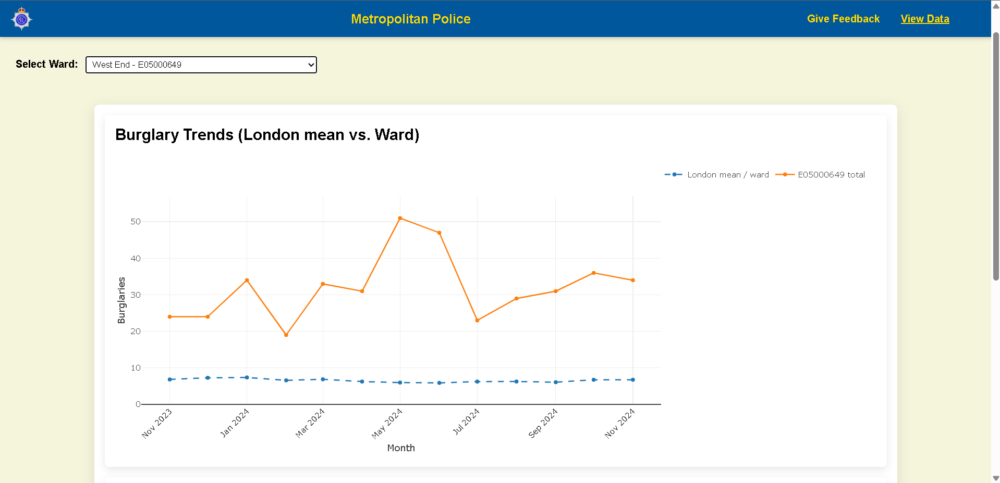
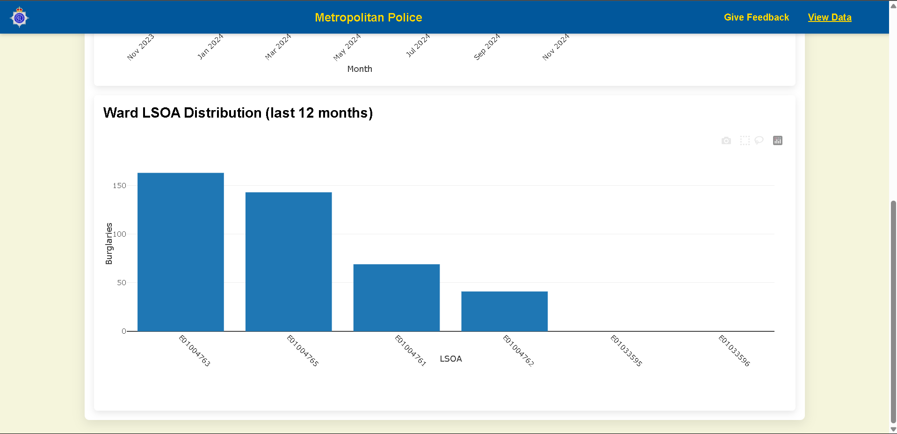
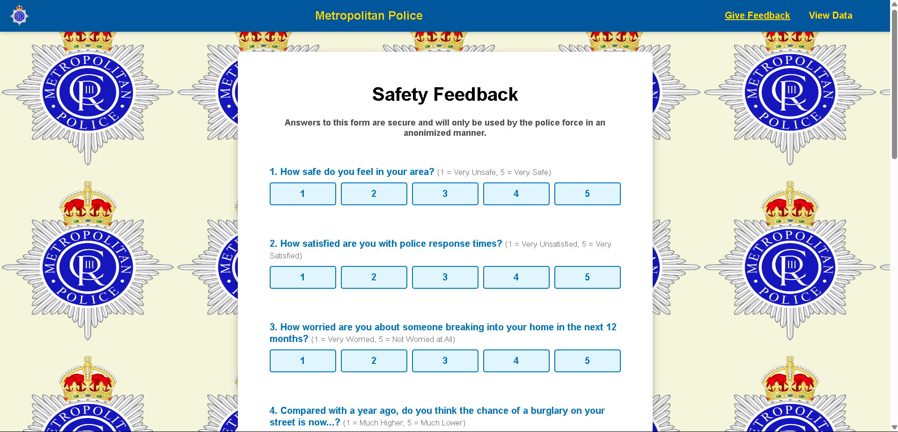
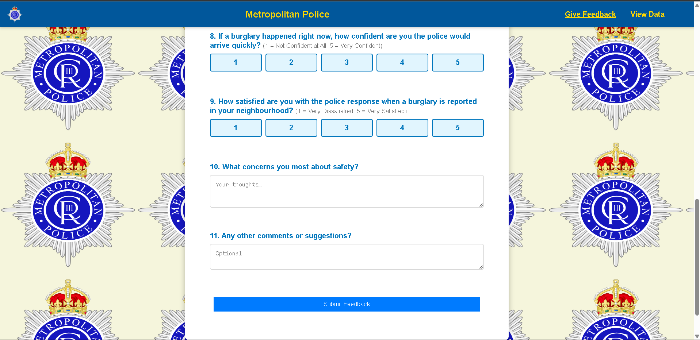

# PolIce force bulgary assistance - Fighting to reduce residential burglary
TU/e Multidisciplinary CBL, helping London police force reduce burlgary rates by predicting crime, allocating their police officers and adding our original twist by including the community in our innovative solution.

This README will give the information necessary to run the project and a summary of its content. This repository was created due to many members having issues in the git history after pushing big data files. This is the second repository used in the project, avoiding the previous problem using a detailed gitignore file. To access the previous repository to see previous group history you can view: 
-> https://github.com/ala-mn/Addressing-real-world-crime-and-security-problems-with-data-science.git

## Our GOAL
The aim of this project was a vague problem to which we had to find a solution, how can we, as a team of Data Scientists and Computer Scientists help the London police force in reducing burglary rates. 

The most obvious solution was predicting burglaries for future month(s). However, we were not satisfied by this solution, and considered that a big part of the police force is not only to reduce the numerical value of burglary rates, but also to make the community feel safe and protected by them, this is why we have developed a solution that not only predicts burglaries with up to 80% R^2, but also takes input from the London community and uses it to give police more in-depth insights. 

## Project Structure

community-tool/   &nbsp;&nbsp;         # Front-end for community survey and visualizations<br>
&nbsp;  ├─ index.html  &nbsp;&nbsp;          # Main html structure of community website<br>
&nbsp;  ├─ feedback.html   &nbsp;&nbsp;      # Community survey page<br>
&nbsp;  ├─ dashboard.html  &nbsp;&nbsp;      # Community visualizations dashboard<br>
&nbsp;  ├─ visuals.js    &nbsp;&nbsp;        # JS for community visualizations<br>
&nbsp;  ├─ script.js   &nbsp;&nbsp;          # Interaction logic for survey<br>
&nbsp;  └─ style.css   &nbsp;&nbsp;          # Styles for community tool<br>

data/         &nbsp;&nbsp;             # Input and output data files<br>
&nbsp;  ├─ burglary_next_month_forecast.csv &nbsp;&nbsp;  # Model outputs (predicted burglaries)<br>
&nbsp;  ├─ crime_fixed_data.csv         &nbsp;&nbsp;      # Master historical burglary dataset<br>
&nbsp;  ├─ topic_sentiment_summary.csv    &nbsp;&nbsp;    # Processed community feedback by topic & sentiment<br>
&nbsp;  ├─ LSOAs.geojson      &nbsp;&nbsp;                # Boundaries for LSOA polygon maps<br>
&nbsp;  ├─ wards.geojson     &nbsp;&nbsp;                 # Boundaries for London wards<br>
&nbsp;  └─ ...              &nbsp;&nbsp;                  # Other CSVs (population, stop-and-search, IMD, etc.)<br>

models/            &nbsp;&nbsp;        # Model artifacts and training code<br>
&nbsp;  ├─ xgb_burglary_model.pkl   &nbsp;&nbsp;          # Trained XGBoost model<br>
&nbsp;  ├─ robust_scaler.pkl     &nbsp;&nbsp;             # Scaler for feature preprocessing<br>

Police-dashboard/    &nbsp;&nbsp;     # Dash app for police users<br>
&nbsp;  ├─ app.py        &nbsp;&nbsp;             # Main Dash application code<br>
&nbsp;  ├─ helper.py     &nbsp;&nbsp;             # Utilities (prediction saving, spatial joins)<br>
&nbsp;  ├─ process_data.py   &nbsp;&nbsp;         # Upload data function process file<br>

Other files         &nbsp;&nbsp;            # Normalization, data exploration, etc.<br>

## Our SOLUTION - in detail
For a few months, the whole thing will be available in policeallocation.live, if it is not there anymore, follow the instructions below.

### Community Tool
Collects and visualises citizen's perceptions of safety, through open and closed questions.

* **Location:** `community-tool/`
* **What it does**
  * Responsive survey form (Likert + open-text).
  * Live charts of perceived-safety scores and topic sentiment versus borough averages.
  * It always included sentiment analysis processing to extract frequent topics and mean sentiment in the survey's open questions.
* **Tech stack:** plain HTML + JS (Plotly, D3) — no server needed once the processed CSVs are present.
* **Run / deploy**
  1. Ensure `data/topic_sentiment_summary.csv` (and any other processed survey outputs) are in the `data/` folder.
  2. Open `community-tool/dashboard.html` in a browser.  
     *Tip: install the Live Server extension, right-click the index.html file and press "Open with Live Server".*

<details>
<summary><strong>Click to view the community platform</strong></summary>

<p align="center">
  &nbsp;
  
</p>
<p align="center">
  &nbsp;
  
</p>

</details>

### Police Dashboard
An interactive Dash application for the London Police Force.

* **Location:** `Police-dashboard/app.py`
* **Main features**
  1. **Map view**  
     * Ward- or LSOA-level choropleths of burglary counts (historical **or** predicted).  
     * Predicted vs. perceived safety heatmap view, normalized and computed difference to identify areas with gaps between perceived community safety and predicted safety.
     * Drill-down: click a ward to reveal constituent LSOAs plus a patrol allocation table.
  2. **Control panel**  
     * Toggle Past / Predicted data, pick date ranges, upload a new month of raw crime CSVs, download auto-generated patrol schedules.
  3. **Perception Analysis modal**  
     * Pops up on demand to show community sentiment top topics.
* **Run locally**
  ```bash
  cd Police-dashboard
  pip install -r requirements.txt     # Dash, Plotly, geopandas, xgboost, etc.
  python app.py

### Predictive Model
XGBoost regression at LSOA level.
* Handles lags and rolling averages effectively for time-aware forecasting
* Captures nonlinear patterns, including seasonality and interaction effects
* Hyper-parameter optimization with Optuna.
* Achieved R^2 = 0.764, with MAE = 0.131